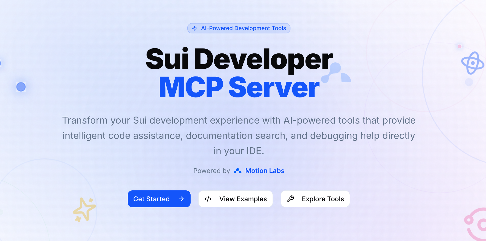

# 🚀 Sui Developer MCP

<div align="center">



**AI-Powered Development Tools for the Sui Blockchain Ecosystem**

_Built with ❤️ by [Motion Labs](https://motionecosystem.com)_

[](https://github.com/MotionEcosystem/sui-dev-mcp/actions/workflows/ci.yml)
[](https://opensource.org/licenses/MIT)
[](https://nodejs.org/)
[](https://www.typescriptlang.org/)
[](https://nextjs.org/)
[](https://sui-dev-mcp.vercel.app)

[🌐 Live Demo](https://sui-dev-mcp.vercel.app) • [📚 Documentation](https://sui-dev-mcp.vercel.app/docs) • [🛠️ Tools](https://sui-dev-mcp.vercel.app/tools) • [🤝 Contributing](#contributing)

</div>

## ✨ Features

### 🔍 Smart Documentation Search

- **AI-powered semantic search** across Sui documentation and ecosystem docs
- **Contextual answers** with relevant code examples
- **Real-time updates** from the latest Sui documentation

### 💻 Code Analysis & Generation

- **Advanced Move code analysis** with security auditing
- **TypeScript SDK generation** for seamless frontend integration
- **Smart contract optimization** recommendations

### 🐛 Intelligent Error Debugging

- **Decode complex Sui transaction errors** with clear explanations
- **Actionable solutions** to reduce debugging time
- **Pattern recognition** for common issues

### 🎨 Modern UI/UX

- **Motion Labs branded** interface with `#215FF6` signature blue
- **Dark/Light mode** support with smooth transitions
- **Responsive design** optimized for all devices
- **Physics-based animations** for engaging user experience

## 🚀 Quick Start

### Prerequisites

- **Node.js** >= 18.0.0
- **npm** >= 8.0.0
- **Claude Desktop** or compatible MCP client

### Installation

1. **Clone the repository**

   ```bash
   git clone https://github.com/MotionEcosystem/sui-dev-mcp.git
   cd sui-dev-mcp
   ```

2. **Install dependencies**

   ```bash
   npm install
   ```

3. **Start development server**

   ```bash
   npm run dev
   ```

4. **Open your browser**
   ```
   http://localhost:3000
   ```

### MCP Setup

Add to your Claude Desktop configuration:

```json
{
  "mcpServers": {
    "sui-dev-mcp": {
      "command": "node",
      "args": ["path/to/sui-dev-mcp/server.js"]
    }
  }
}
```

## 🛠️ Development

### Available Scripts

| Script               | Description                  |
| -------------------- | ---------------------------- |
| `npm run dev`        | Start development server     |
| `npm run build`      | Build for production         |
| `npm run start`      | Start production server      |
| `npm run lint`       | Run ESLint                   |
| `npm run lint:fix`   | Fix ESLint issues            |
| `npm run type-check` | Run TypeScript type checking |
| `npm run test`       | Run unit tests               |
| `npm run test:e2e`   | Run E2E tests                |
| `npm run format`     | Format code with Prettier    |

### Project Structure

```
sui-dev-mcp/
├── .github/workflows/     # GitHub Actions CI/CD
├── .husky/               # Git hooks
├── .vscode/              # VS Code settings
├── public/               # Static assets
│   └── motion/           # Motion Labs branding
├── src/
│   ├── app/              # Next.js app directory
│   ├── components/       # React components
│   └── lib/              # Utilities
├── tests/
│   ├── e2e/              # Playwright E2E tests
│   └── unit/             # Jest unit tests
└── docs/                 # Documentation
```

### Tech Stack

- **Framework**: [Next.js 15](https://nextjs.org/) with App Router
- **Language**: [TypeScript](https://www.typescriptlang.org/)
- **Styling**: [Tailwind CSS](https://tailwindcss.com/) + Custom CSS
- **UI Components**: [Radix UI](https://www.radix-ui.com/)
- **Icons**: [Lucide React](https://lucide.dev/)
- **Testing**: [Jest](https://jestjs.io/) + [Playwright](https://playwright.dev/)
- **Linting**: [ESLint](https://eslint.org/) + [Prettier](https://prettier.io/)
- **Git Hooks**: [Husky](https://typicode.github.io/husky/)

## 🏗️ Architecture

### Motion Labs Branding

The application features comprehensive Motion Labs branding:

- **Primary Color**: `#215FF6`
